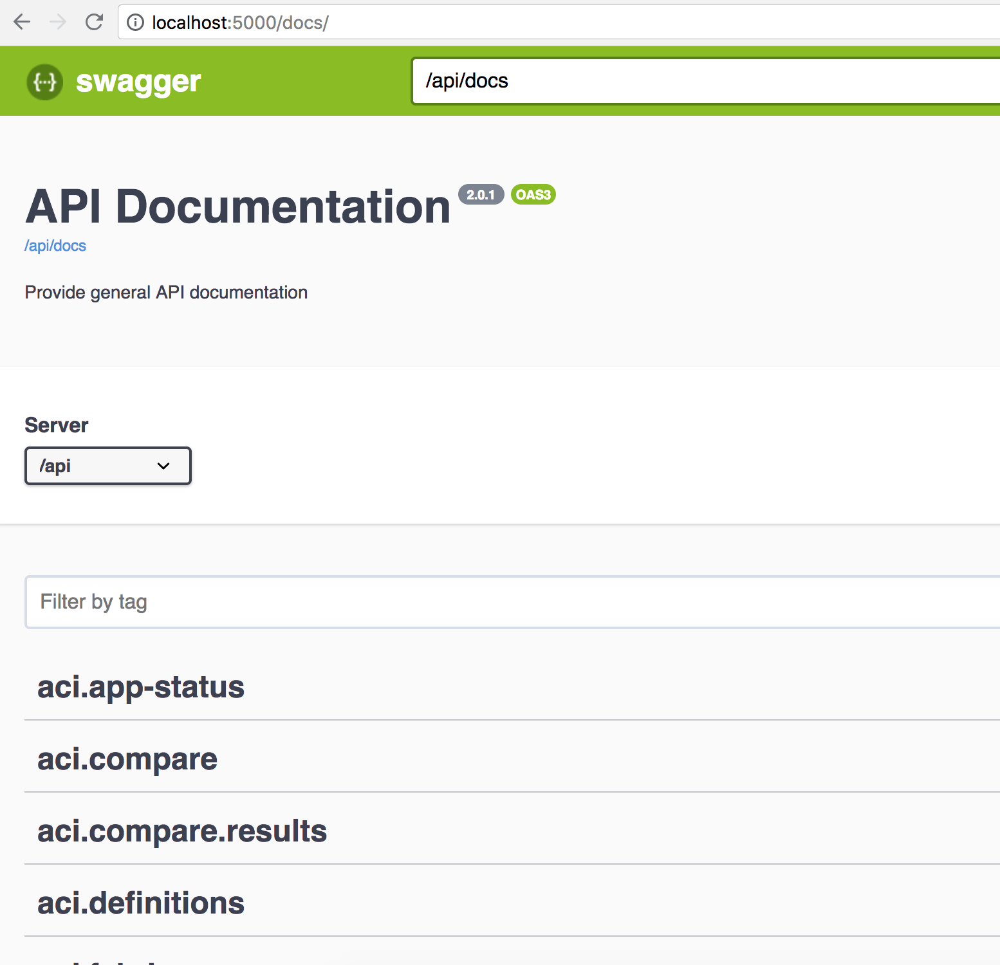

API
===

Statechecker implements a restful ``api`` with auto-created swagger documentation for each endpoint.
The swagger documentation is available at /docs.

|swagger_docs_example_1|

The ``api`` implements basic CRUD (create, read, update, delete) operations for objects that 
support them. In general, create requests are issued via an HTTP POST, read requests via an HTTP
GET, update requests via HTTP PATCH, and delete vai HTTP DELETE.  The url endpoint, parameters, and
responses are all provided in the swagger docs. 

.. note::  the swagger documentation is only viewable in ``standalone`` mode.

Authentication
^^^^^^^^^^^^^^

Authentication can be enabled or disabled by the ``LOGIN_ENABLED`` option. This can be set via an 
environmental variable in the container, updates to ``config.py`` or ``instance/config.py`` values.  
It is enabled by default in ``standalone`` mode and disabled in ``app`` mode as APIC handles all 
authentication and authorization.

Session management is handled by login and logout APIs under the users class. For login, a cookie
named 'session' is returned and should be provided in all subsequent API calls.

.. code-block:: bash

    # login
    curl -X POST "http://localhost:5000/api/users/login" -H "Content-Type: application/json" \
        -d '{"password":"cisco","username":"admin"}'

    # logout
    curl -X POST "http://localhost:5000/api/users/logout" 

APIC API access to StateChecker App
^^^^^^^^^^^^^^^^^^^^^^^^^^^^^^^^^^^

When running in ``app`` mode and deployed on the Cisco ACI APIC, the app is accessible via the 
**http://<apic-ip>/appcenter/Cisco/StateChangeChecker/proxy.json**.   Note, the APIC restrics apps
to GET and POST methods only. Additionally, only static url endpoints are allowed.  Since this app
uses GET, POST, PATCH, and DELETE as well as dynamic url endpoints, a ``proxy`` option was 
implemented to allow it to run on the APIC.  For the proxy, all requests are sent as POST to 
``proxy.json`` endpoint with the following required in the data field:

- **method**
  The original method intended for the app (GET, POST, PATCH, or DELETE)
- **url**
  The original url that is indented to be proxied. As an example, to get a list of snapshots, the 
  url would be /api/aci/snapshots as seen in the swagger docs.
- **data**
  The original data sent via POST, PATCH requests.

The user most also have admin read access on the APIC and use the APIC aaaLogin api to acquire a 
``token`` and ``urlToken`` for accessing the app API. The ``token`` must be included in all 
requests as a cookie named **APIC-Cookie** or an HTTP header named **DevCookie**.  The ``urlToken`` 
must be included in all requests as a url parameter named **url-token** or HTTP header named 
**APIC-Challenge**

For example:

.. code-block:: bash

    # login
    curl -kX POST "https://<apic-ip>/api/aaaLogin.json?gui-token-request=yes" \
        -H "Content-Type: application/json" \
        -d '{"aaaUser":{"attributes":{"name":"<username>", "pwd":"<password>"}}}' \
        | python -m json.tool

    {"imdata": [
        {"aaaLogin": {
                "attributes": {
                    "buildTime": "Thu Apr 19 17:17:39 PDT 2018",
                    "changePassword": "no",
                    "creationTime": "1536530859",
                    "firstLoginTime": "1536530859",
                    "firstName": "",
                    "guiIdleTimeoutSeconds": "65525",
                    "lastName": "",
                    "maximumLifetimeSeconds": "86400",
                    "node": "topology/pod-1/node-1",
                    "refreshTimeoutSeconds": "9600",
                    "remoteUser": "false",
                    "restTimeoutSeconds": "90",
                    "sessionId": "weTl7S7hSx6CQ4KkkLZ21g==",
                    "siteFingerprint": "B4NoUf+/99ZZsL5K",
                    "token": "OxAAAAAAAAAAAAAAAAAAAHQGVL9YKcIy2...", <---- token
                    "unixUserId": "15374",
                    "urlToken": "2f70d689cb5fd9aa3ff63046...",  <--------- urlToken
                    "userName": "admin",
                    "version": "3.1(2o)"
                },
    <snip>

    # access app api
    curl --header "DevCookie: AAAAAAAAAAAAAAAAAAAHQGVL9YKcIy2..." \
    	 --header "APIC-Challenge: 2f70d689cb5fd9aa3ff63046..." \
    	 -kX POST "https://<apic-ip>/appcenter/Cisco/StateChangeChecker/proxy.json" \
    	 -d '{"url": "/api/aci/snapshots", "method":"GET"}'
 

More information on using the Cisco API is available on `Cisco APIC REST API Configuration Guide
<https://www.cisco.com/c/en/us/td/docs/switches/datacenter/aci/apic/sw/2-x/rest_cfg/2_1_x/b_Cisco_APIC_REST_API_Configuration_Guide/b_Cisco_APIC_REST_API_Configuration_Guide_chapter_01.html/>`_

