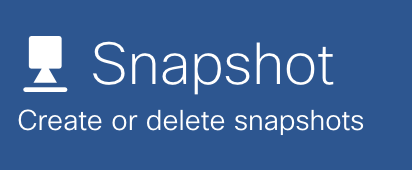
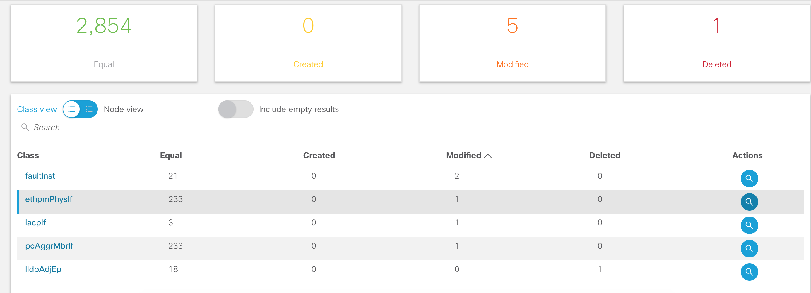

Usage
=====

StateChecker allows the operator to collect snapshots of the fabric and perform comparisons to 
understand how the fabric has changed. To get started, perform the following steps:

- `Configuring Users`_
- `Connecting to the Fabric`_
- `Creating Snapshots`_
- `Creating Comparisons`_
- `Managing Definitions`_

.. note:: There a few differences when running StateChecker in ``app mode`` vs. ``standalone``. 
    In ``app mode``, all authentication and authorization is handled by the APIC and not enabled 
    on the app.  Second, only the fabric in which the app is installed can be monitored. The app 
    uses certificates installed by the APIC to access the MOs and therefore no fabric setup or 
    configurations are required. All **fabric** and **user** options are hidden when running in 
    ``app mode``.

Configuring Users
^^^^^^^^^^^^^^^^^

.. note:: Configuring users is only available in ``standalone`` mode

At install a single user is created with username ``admin`` and default password ``cisco``.
Operators can configure multiple users for accessing StateChecker app. A user can have one of three
roles:

- ``FULL_ADMIN`` role is capable of performing on all read and write operations within the app
- ``USER`` role is a read only role that can view snapshots and comparisons but cannot create or 
  edit them
- ``BLACKLIST`` role is not allowed to access the application

Click the users icon |icon_users| at the top right of the application to manage users.  Users can 
be added, deleted, and updated as needed. Also, the user tab allows passwords to be changed. It is 
highly recommended to change the default password.

Connecting to the Fabric
^^^^^^^^^^^^^^^^^^^^^^^^

.. note:: Configuring the fabric is only available in ``standalone`` mode

A fabric refers to a single APIC cluster and corresponding switches.  StateChecker app can be 
configured to perform snapshots across multiple fabrics.  Note, snapshot comparison must be between
two snapshots collected from the same fabric.

To get started, click the fabric icon |icon_fabric|. Click the add icon |icon_add| to add a new 
fabric. Configure the following for connecting to the fabric:

- **Name** 
  unique identifier for this fabric
- **Hostname** 
  DNS hostname or IP address of a single APIC in the cluster. Ideally this would be 
  APIC-1 but can be any APIC in the cluster. The other APIC controlers within the cluster are 
  discovered dynamically and their out-of-band IPv4 addresses are cached and used in the absence of 
  the configure hostname
- **Username** 
  for API access to the fabric.  Note, the user must have ``admin`` read
  access to the MOs in the fabric for proper operation of StateChecker app.
- **Password** for configured username

The app will test the configured credentials at the time the fabric is created or edited. Users can
additionally test access for a configured fabric by clicking the verify icon |icon_verify|.

Any changes to the configured fabrics should automatically be updated within the GUI. Users can also
click the refresh icon |icon_refresh| to manually refresh the state of all configured fabrics.

Creating Snapshots
^^^^^^^^^^^^^^^^^^

A snapshot is the collection of managed objects (MOs) from the fabric. The specific MOs collected 
are dependent on the definition chosen. By default, the ``Full`` definition is selected which 
collects all MOs within the app. See `Managing Definitions`_ for more details on definitions.

To collect a snapshot, click the snapshot icon |icon_snapshot|.  Next, click the add icon |icon_add| 
and provide a **description**, **definition**, and a **fabric**. Note, when running in ``app mode`` 
the fabric option is not available.

For backup purposes, a snapshot can be downloaded. Once a snapshot has completed, click the 
download icon |icon_download| which will create a **.tgz** file with all snapshot data. This can 
later be imported back into the app via the upload icon |icon_upload|.  There are a few restrictions
to be aware of when using the upload operation:

- The fabric name for the uploaded snapshot must exist within the app
- The definition name for the uploaded snapshot must exist within the app
- When running in ``app_mode``, there is a **20MB** limitation on file uploads. The snapshot must be
  less than **20MB** to import.

Creating Comparisons
^^^^^^^^^^^^^^^^^^^^^

Operators can compare snapshots to determine what has changed within the fabric.  To perform a 
comparison, click the comparison icon |icon_comparison| and then add comparison |icon_add|. There
are several options for a comparison:

- **Snapshot 1**
  The first snapshot to be compared
- **Snapshot 2**
  The second snapshot to be compared.  Note, if snapshot2 is before snapshot1 based on the
  collection time within the snapshot, the app will swap snapshot1 and snapshot2 pointers
- **Definition**
  The definition to use for the comparison. The definition is a list of one or more MOs. Here,
  the definition is used as a filter to control which objects are compared.
  See `Managing Definitions`_ for more details.
- **Nodes**
  Operators can filter the comparison to a selection of one or more nodes. This is useful when a
  maintenance window has been performed and there are several known changes that have occurred but
  operators expect specific state to be the same on a subset of leafs.  For example, the addition
  of new service leafs should not have affected ``Access`` MOs on the border leafs.
  By default this option is empty which implies that the comparison should be performed on all
  nodes within the snapshots.
- **Compare Options**
  There are a few knobs to control how the comparison is performed.

  + **Dynamic**
    Some MOs along with MOs attributes are marked as **dynamic**.  Dynamic objects and attributes 
    are those which are expected to change between snapshots.  Examples includes hardware indexes
    and file descriptor. 
    The dynamic option is **disabled** by default.

  + **Remap**
    ACI abstracts logical resources from concrete values. For example, a user creates a 
    BD and EPG and deploys it to a leaf. This logical model translates to a concrete vlan with a 
    vlan identifier that is arbitrarily allocated. Removing and readding the EPG or reloading the
    switch may result in a different vlan id for a particular EPG.  To perform comparison between
    snapshots, the StateChecker application will map the vlan identifier to a consistent logical
    value.  Other objects that are remapped include include port-channels, sub-interfaces, tunnels,
    and loopback interfaces.  Also, all MOs that reference this objects will also be remapped. For
    example, a route next hop may contain a vlan id that needs to be remapped before snapshot
    comparison.
    The remap option is **enabled** by default

  + **Statistic**
    Some object and attributes are statistics (counters) that are expected to increment at a regular
    interval. Operators can choose to include or exclude statistics during comparison via this 
    option.
    The dynamic option is **disabled** by default.

  + **Timestamp**
    Timestamp MOs and attributes generally reference the time in which the value was created or 
    modified. Operators can choose to include or exclude timestamps during comparison via this
    option.
    The dynamic option is **disabled** by default.

  + **Serialize**
    (development only)
    Snapshot comparisons can involve 10's to 100's of thousands of objects. For efficiency this is
    performed in parallel by multiple processes.  For debugging, users can force comparison to 
    operate serially. 
    The dynamic option is **disabled** by default.

Once a comparison is completed, click the zoom icon |icon_search| to see the details. The comparison
page includes the overall totals of equal, created, modified, and deleted objects. Operators can
further drill down into specific nodes and specific classes to understand what changes have
occurred.  

|compare_example_1|

Managing Definitions
^^^^^^^^^^^^^^^^^^^^

A definition is a collection of one or more managed objects (MOs). Operators can add and modify 
definitions by clicking the definition icon |icon_edit| at the top right of the page. There are 
four predefined definition templates that cannot be modified:

- **Full**
  default definition that includes all MOs defined within the app
- **Access**
  This definition collects access information including basic interface status, switch inventory 
  information, along with L1/L2 state.
- **Routing**
  This definition collects basic information about L2/L3 local endpoint and route reachability state. 
  This includes protocol status, adjacency information, and routing information base (RIB) state.
- **VMM**
  This definition collects virtual machine manager (VMM) information focusing on hypervisor 
  connectivity, inventory, and topology state.

Operators can click the add icon |icon_add| to create a new definition.  A definition includes a 
name, description, and list of MOs (classes). This helpful for operators who have a specific set of
objects that need to be compared outside of the predefined templates.

